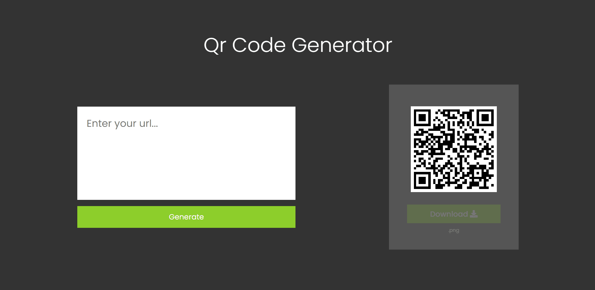

<h1 align='center'>Qr Code Generator</h1>

<h2 align='center'>About</h2>

<h3 align='center'>Qr Code Generator that allows the user to create and download a qr code generated by the <a href="https://davidshimjs.github.io/qrcodejs/" target='_blank'>QRCode.js</a></h3>

## 🚀 Technologies

<ul>
    <li>Javascript</li>
    <li>html</li>
    <li>css</li>
</ul>

  <h3>My linkedin</h3>
  

Made by João Pedro
